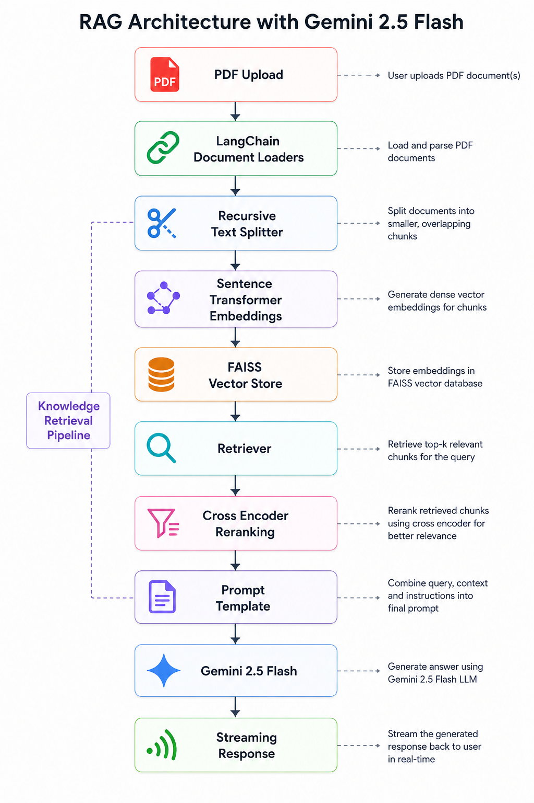

# Context-Aware RAG Chatbot (PDF Q&A with Gemini AI)


---

Deployed App Link:
https://pdfcantalk.streamlit.app/

---

## 📌 Overview

This project is a **Retrieval-Augmented Generation (RAG) based AI chatbot** that allows users to upload PDF documents and interact with them using natural language queries.

The system retrieves relevant context from uploaded documents and uses **Google Gemini AI** to generate accurate, context-aware responses with source citations.

It is built using **Streamlit + LangChain + FAISS + Gemini Embeddings**.

---


---

## 🚀 Features

- 📄 Upload multiple PDF files
- 📦 AI-powered document understanding (RAG pipeline)
- 🔎 Semantic search using FAISS vector database
- 💬 Conversational chatbot interface
- 📚 Source citations with expandable references
- ⚡ Powered by Google Gemini (`gemini-2.5-flash`)
- 💾 Conversation memory support
- 💡 Clean and interactive Streamlit UI
- 🔐 API key input via sidebar (no hardcoding)

---

## System Architecture

 

---

## Tech Stack

| Component        | Technology |
|----------------|-----------|
| Frontend       | Streamlit |
| LLM            | Google Gemini (`gemini-2.5-flash`) |
| Embeddings     | `gemini-embedding-001` |
| Framework      | LangChain |
| Vector DB      | FAISS |
| PDF Processing  | PyMuPDF (`fitz`) |
| Language       | Python (3.11) |

---

## 📦 Installation

### 1️⃣ Clone Repository
```bash
git clone https://github.com/maw-khan/context-aware-rag-chatbot-gemini.git
pip install -r requirements.txt
```

---

🔑 API Key Setup
You need a Google Gemini API Key.
Get it from:
👉 https://ai.google.dev/
No need for .env file — the app accepts it directly via Streamlit sidebar.


---

▶️ Run the Deployed App (Link):

https://pdfcantalk.streamlit.app/

---

## 💡 How to Use
1. Enter your Gemini API Key in the sidebar
2. Upload one or more PDF files
3. Click “Process PDFs”
4. Wait for indexing to complete
5. Start asking questions in the chat box
6. View answers + expandable source references

Example Use Cases
- Research paper Q&A
- Study notes assistant
- Legal document analysis
- Business report summarization
- Book understanding chatbot

📚 Example Query
“What is the main conclusion of the document?”
The chatbot will:
- Retrieve relevant chunks
- Generate an answer using Gemini
- Show source excerpts used for reasoning
  


---

## ⚙️ Key Components Explained
🔹 Chunking
Uses RecursiveCharacterTextSplitter to split documents into overlapping chunks for better retrieval accuracy.

🔹 Vector Search
FAISS is used for fast similarity search across embeddings.

🔹 Memory
ConversationBufferMemory maintains chat context across multiple queries.

🔹 RAG Chain
ConversationalRetrievalChain combines retrieval + LLM generation.

---

## 🔮 Future Improvements
- 📌 Add document upload history
- 🔐 Add user authentication
- 📊 Add analytics dashboard
- 💾 Save chat sessions permanently

---

## ⚠️ Limitations
- Large PDFs may take time to process
- Requires valid Gemini API key
- Works best with text-based PDFs (not scanned images)

---

## 👨‍💻 Author
Muhammad Ali Waris Khan
- AI / ML Enthusiast | Building RAG Systems & LLM Applications
