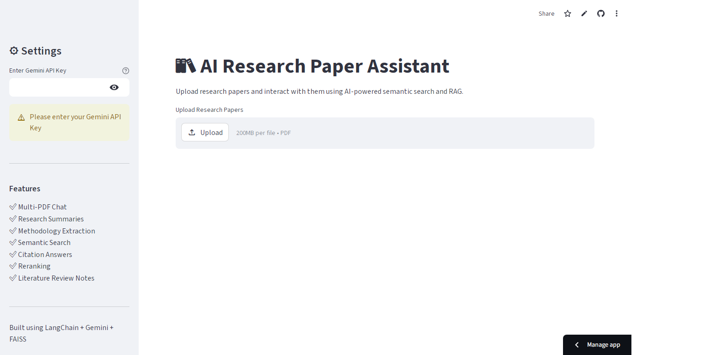
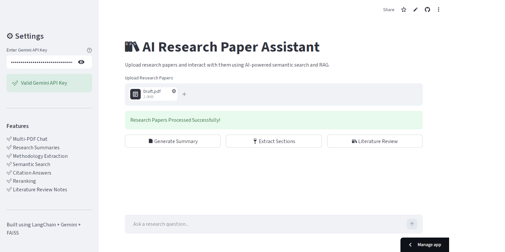
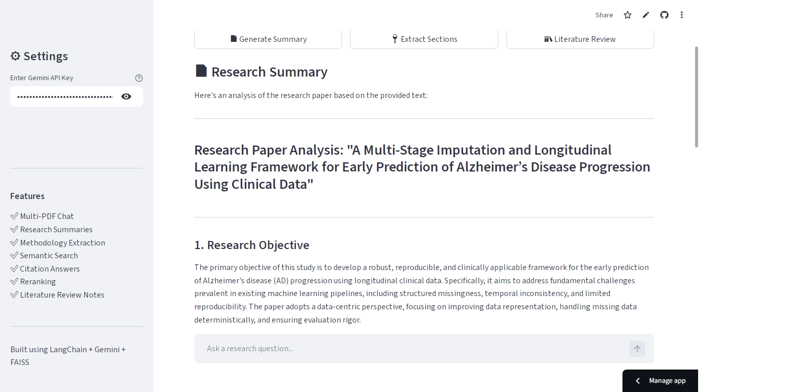

# AI Research Paper Assistant (Multi-PDF RAG System with Gemini AI)


---

## 🚀 Live Demo

Deployed App Link:
https://chatwithresearchpaper.streamlit.app/

---

# 📌 Overview

The **AI Research Paper Assistant** is an advanced **multi-document Retrieval-Augmented Generation (RAG) application** designed specifically for research and academic workflows.

This system allows users to upload multiple research papers in PDF format and interact with them using natural language queries powered by **Google Gemini AI**.

Unlike basic PDF chatbots, this application includes:

* 📚 Research paper summarization
* 💬 Literature review generation
* 📚 Methodology extraction
* 🔎 Semantic retrieval
* 📄 Key section extraction
* ⚡ Reranking for improved retrieval quality

The application combines **LangChain + Gemini AI + FAISS + Cross-Encoder Reranking** to create a professional-grade academic assistant capable of understanding and analyzing complex research documents.

Built with a clean and interactive **Streamlit UI**.

---



---

# 🚀 Features

* 📄 Upload and analyze multiple research papers
* ⚡ AI-generated research summaries
* 📚 Literature review notes generation
* 💡 Automatic methodology extraction
* 📑 Abstract, methodology, and conclusion extraction
* 🔎 Semantic similarity search using FAISS
* 🎯 Cross-encoder reranking for improved context retrieval
* 💬 Conversational research paper chatbot
* 📚 Expandable retrieved citation chunks
* ⚡ Powered by Google Gemini (`gemini-2.5-flash`)
* 🔐 Secure API key input through sidebar
* 💡 Clean and responsive Streamlit UI
* ⚠️ Graceful handling of Gemini API quota/server errors
* ⏳ Real-time processing spinners and status updates

---

# 🏗️ System Architecture


---

# 🛠️ Tech Stack

| Component       | Technology                         |
| --------------- | ---------------------------------- |
| Frontend        | Streamlit                          |
| LLM             | Google Gemini (`gemini-2.5-flash`) |
| Embeddings      | `gemini-embedding-001`             |
| Framework       | LangChain                          |
| Vector Database | FAISS                              |
| Reranking       | SentenceTransformers Cross-Encoder |
| PDF Processing  | PyMuPDF (`fitz`)                   |
| Language        | Python                      |

---

# 📂 Project Structure

```bash
AI-Research-Paper-Assistant/
│
├── app.py
├── requirements.txt
├── README.md
│
├── utils/
│   ├── chains.py
│   ├── helpers.py
│   ├── loader.py
│   ├── prompts.py
│   ├── reranker.py
│   ├── sections.py
│   └── vectorstore.py
│
├── images/
│   ├── homepage.png
│   ├── architecture.png
│   └── chat_example.png
│
└── data/
```

---

# 📦 Installation

## 1️⃣ Clone Repository

```bash
git clone https://github.com/maw-khan/research-paper-assistant.git
```

---

## 2️⃣ Install Requirements

```bash
pip install -r requirements.txt
```

---

# 🔑 API Key Setup

This project requires a **Google Gemini API Key**.

Get your API key from:

👉 https://ai.google.dev/

The application securely accepts the API key directly through the Streamlit sidebar.

No `.env` configuration required.

---



---

# ▶️ Run the Application

## Local Run

```bash
streamlit run app.py
```

---

## Run Deployed Version

https://chatwithresearchpaper.streamlit.app/

---

# 💡 How to Use

1. Enter your Gemini API key in the sidebar
2. Upload one or multiple research papers
3. Wait for vector indexing to complete
4. Use available research tools:
   * Generate Research Summary
   * Extract Key Sections
   * Generate Literature Review Notes
6. Ask research questions in the chat interface
7. View retrieved citation chunks for transparency

---

# 📚 Example Use Cases

* Research paper analysis
* Literature review generation
* Thesis support assistant
* Academic note generation
* Scientific methodology extraction
* Multi-paper comparison
* Research Q&A assistant

---

# 💬 Example Query

### User Question:

> “What methodologies were commonly used across these papers?”

The assistant will:

* Retrieve relevant semantic chunks
* Rerank retrieved passages
* Generate a context-aware response using Gemini AI
* Display supporting retrieved citations

---



---

# ⚙️ Key Components Explained

## 🔹 Multi-PDF Processing

Multiple research papers are processed simultaneously and merged into a unified searchable knowledge base.

---

## 🔹 Semantic Chunking

Documents are split into overlapping chunks for improved retrieval quality and context preservation.

---

## 🔹 Vector Search

FAISS vector database enables fast semantic similarity search over document embeddings.

---

## 🔹 Cross-Encoder Reranking

Retrieved chunks are reranked using transformer-based reranking models to improve answer relevance.

---

## 🔹 Research-Oriented Prompting

Custom prompt engineering is used for:

* Literature review generation
* Research summaries
* Methodology extraction
* Academic-style responses

---

## 🔹 Gemini API Error Handling

The application gracefully handles:

* Rate limits
* Quota exhaustion
* Temporary server overload
* Invalid API keys

without exposing technical tracebacks to users.

---

# 🔮 Future Improvements

* 📌 Research paper citation export
* 📄 PDF report generation
* 🔮 Persistent conversational memory
* 🔍 Advanced filtering and search
* 📌 arXiv paper integration
* 📄 Multi-user authentication
* ☁️ Cloud vector database integration

---

# ⚠️ Limitations

* Large PDF collections may require longer processing time
* Requires valid Gemini API access
* Works best with text-based PDFs
* Free Gemini API tier has request limitations

---

# 👨‍💻 Author

Muhammad Ali Waris Khan

AI/ML Enthusiast | RAG Systems | LLM Applications | Generative AI Developer
